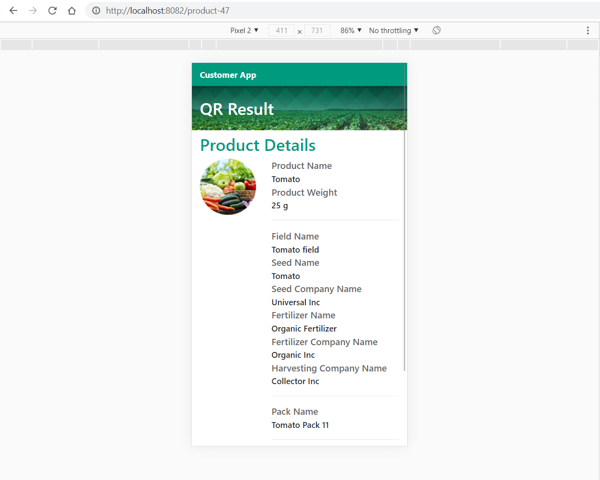

# Customer App

### Customer app is targeted for mobile devices.
### The way it works is that the user scans the QR code and then a window will open displaying all the available information for it


## Project setup
```
npm install
```

### Compiles and hot-reloads for development
```
npm run serve
```

