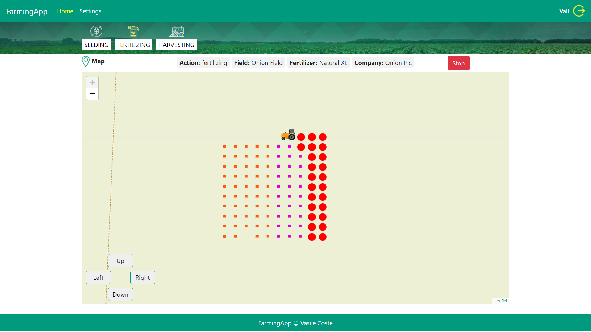

# Farming App

### This app is used to track every action on the field, from seeding, to fertilizing, to harvesting. 

### Altrought the screens may seem the same the functionality is not!

## `Screen Shots`

<table style="padding:10px">
	<tr><td colspan="2"><b>Auth</b></td></tr>
	<tr>
		<td></td>
		<td></td>
	</tr>
	<tr><td colspan="2"><b>Profile</b></td></tr>
	<tr>
		<td></td>
		<td></td>
	</tr>
	<tr><td colspan="2"><b>Seeding</b></td></tr>
	<tr>
		<td></td>
		<td></td>
	</tr>
	<tr><td colspan="2"><b>Fertilizing</b></td></tr>
	<tr>
		<td></td>
		<td></td>
	</tr>
	<tr><td colspan="2"><b>Harvesting</b></td></tr>
	<tr>
		<td></td>
		<td></td>
	</tr>
	<tr><td colspan="2"><b>Settings Seeding</b></td></tr>
	<tr>
		<td></td>
		<td></td>
	</tr>
	<tr>
		<td></td>
		<td></td>
	</tr>
	<tr><td colspan="2"><b>Settings Fertilizing</b></td></tr>
	<tr>
		<td></td>
		<td></td>
	</tr>
	<tr>
		<td></td>
		<td></td>
	</tr>
	<tr><td colspan="2"><b>Settings Harvesting</b></td></tr>
	<tr>
		<td></td>
		<td></td>
	</tr>
	<tr><td colspan="2"><b>Settings Map</b></td></tr>
	<tr>
		<td></td>
		<td></td>
	</tr>
</table>

## Project setup
```
npm install
```

### Compiles and hot-reloads for development
```
npm run serve
```