# Packaging App

### Packaging app is used to create products, packages and transport, also display analytics about them.

## `Screen Shots`

<table style="padding:10px">
	<tr><td colspan="3"><b>Auth</b></td></tr>
	<tr>
		<td>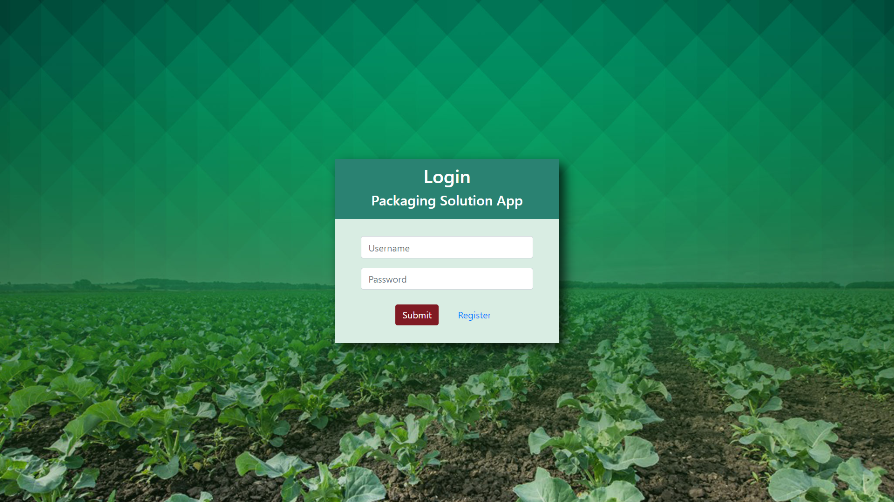</td>
		<td>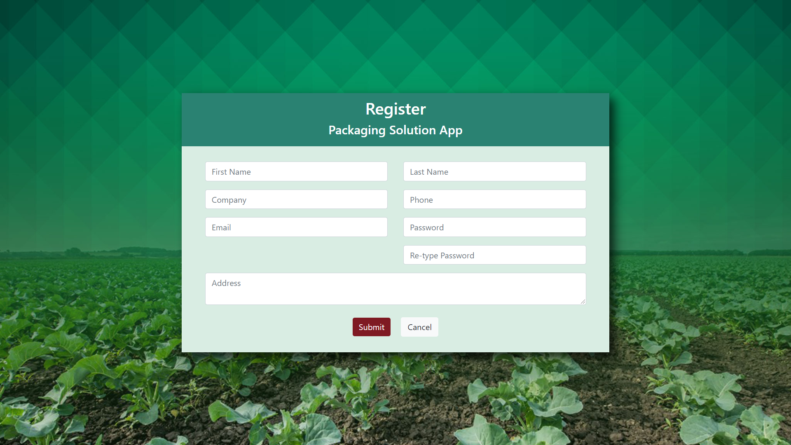</td>
	</tr>
	<tr><td colspan="3"><b>Home / Profile</b></td></tr>
	<tr>
		<td>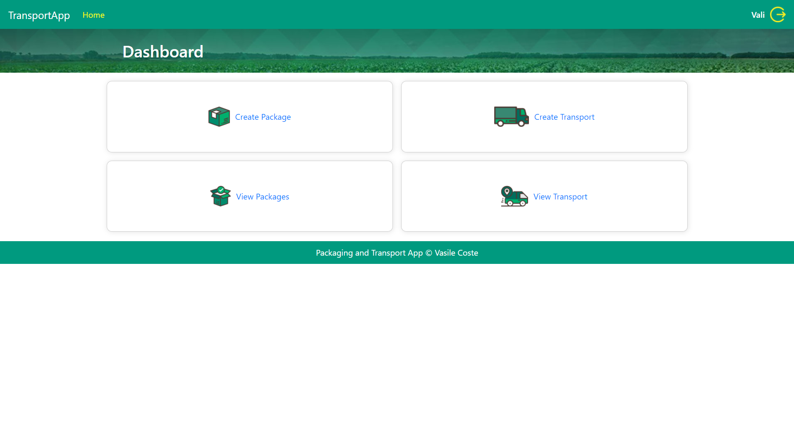</td>
		<td>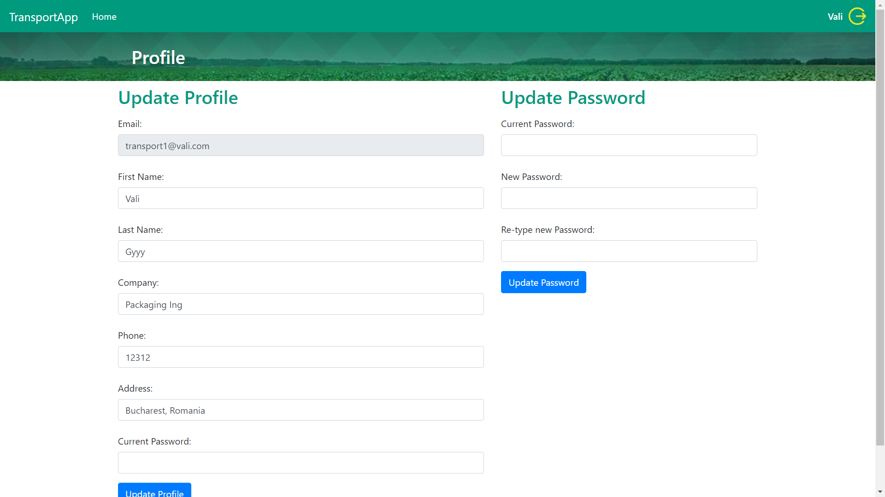</td>
	</tr>
	<tr><td colspan="3"><b>Packaging</b></td></tr>
	<tr>
		<td>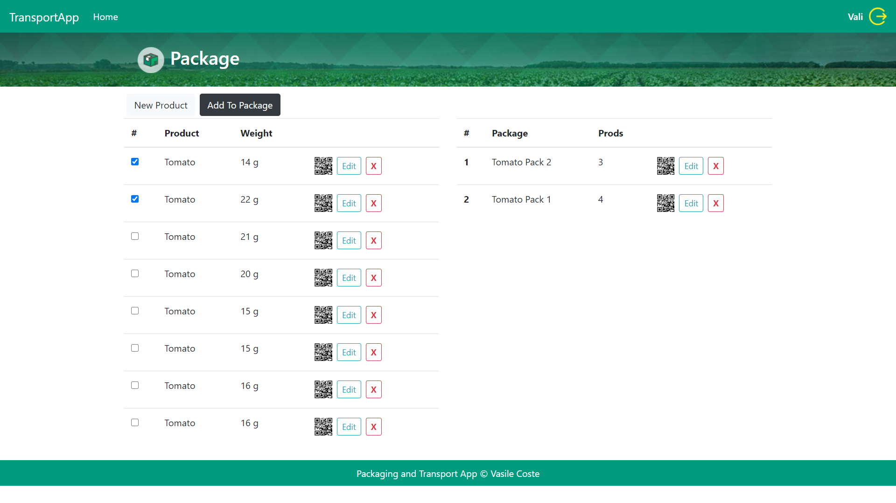</td>
		<td>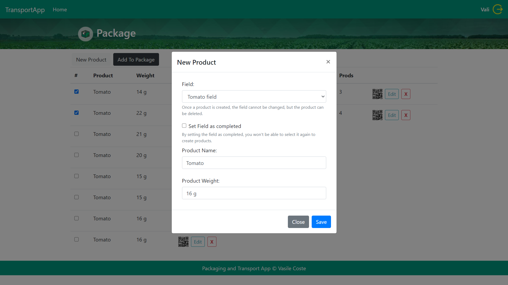</td>
	</tr>
	<tr>
		<td>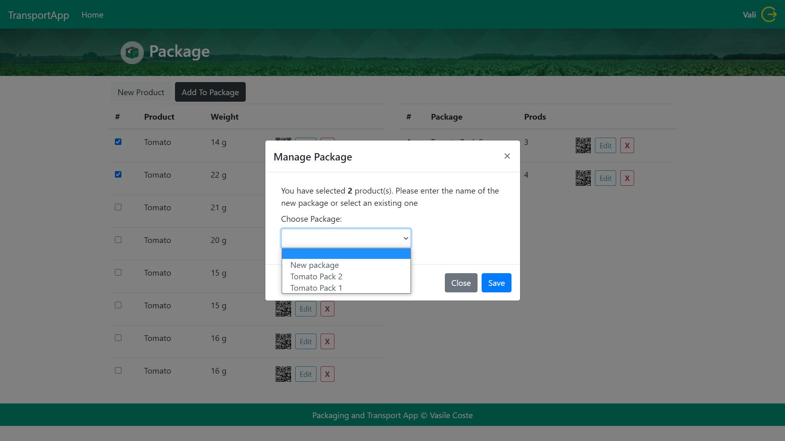</td>
		<td>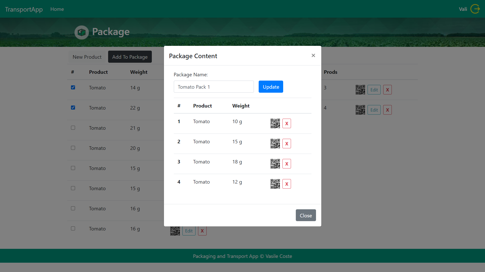</td>
	</tr>
	<tr><td colspan="3"><b>Transport</b></td></tr>
	<tr>
		<td>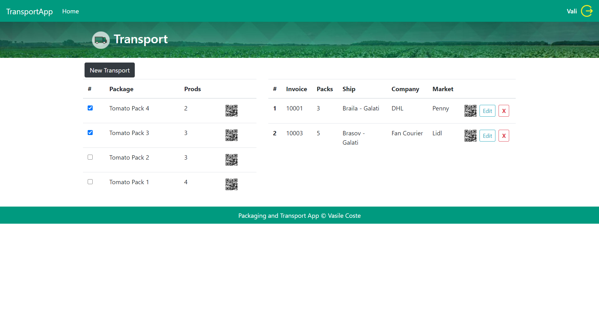</td>
		<td>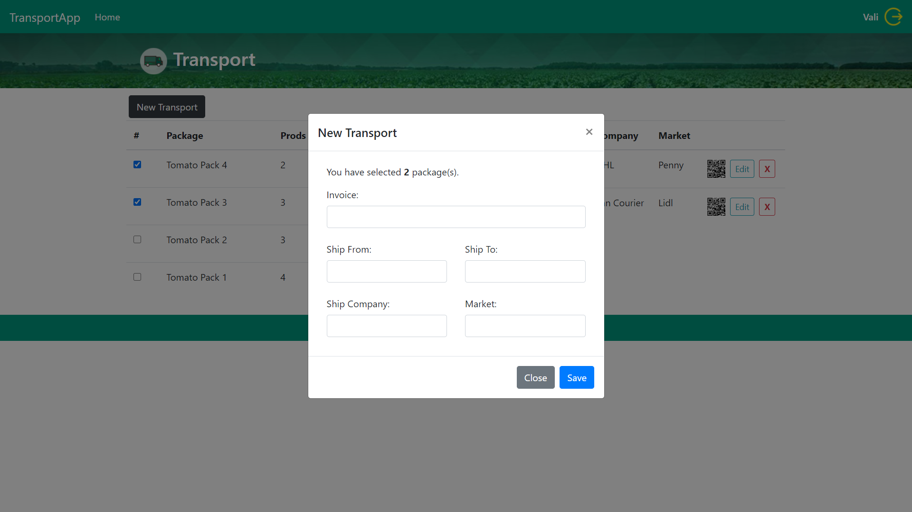</td>
	</tr>
	<tr>
		<td></td>
		<td></td>
	</tr>
	<tr><td colspan="3"><b>View Packaging</b></td></tr>
	<tr>
		<td>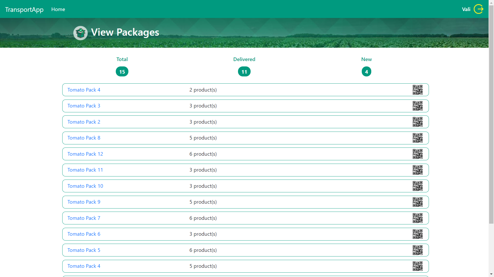</td>
		<td>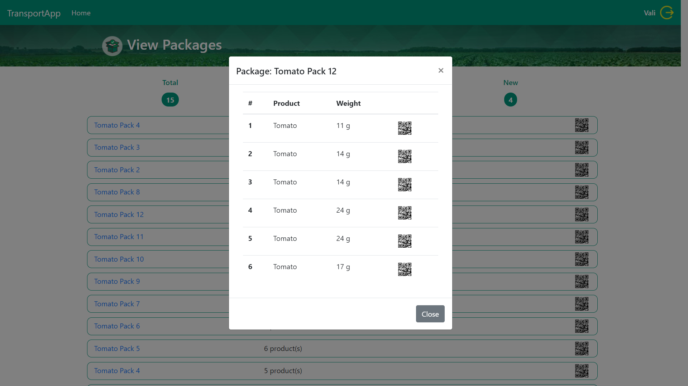</td>
	</tr>
	<tr><td colspan="3"><b>View Transport</b></td></tr>
	<tr>
		<td>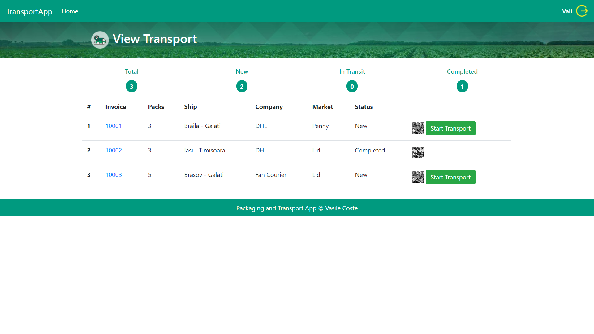</td>
		<td>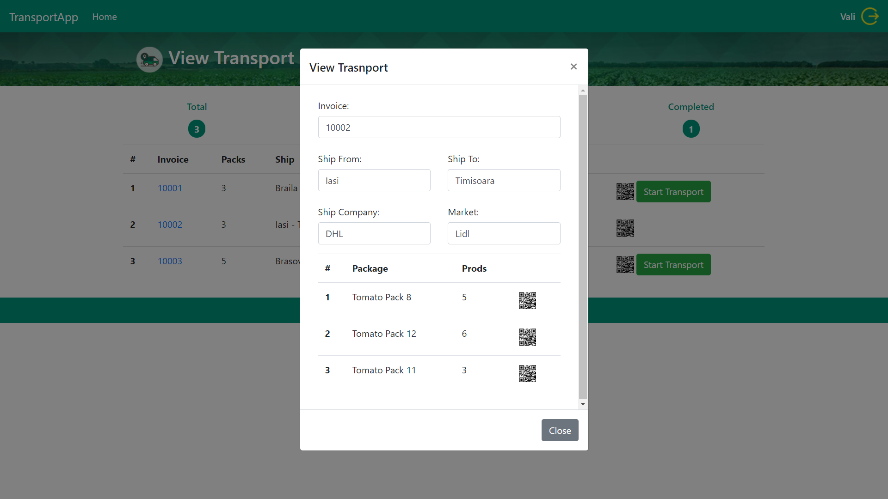</td>
	</tr>
	<tr>
		<td>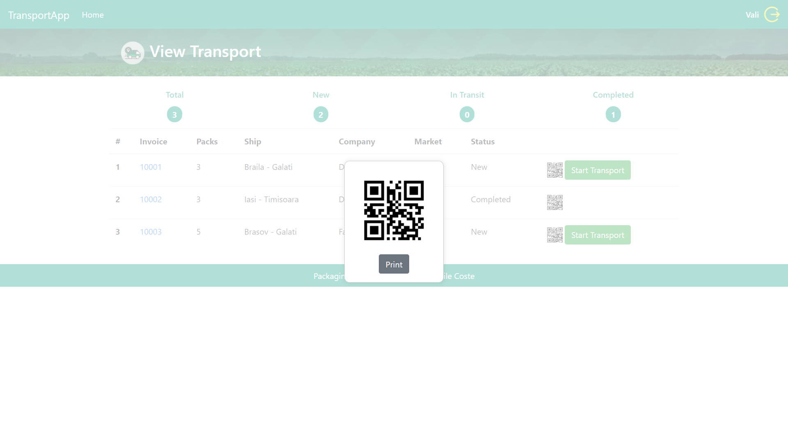</td>
		<td></td>
	</tr>
</table>

## Project setup
```
npm install
```

### Compiles and hot-reloads for development
```
npm run serve
```
